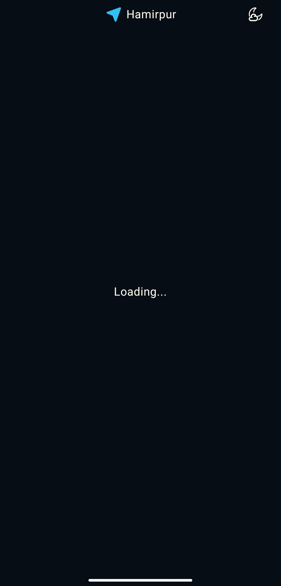
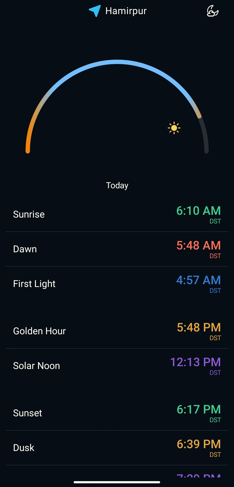
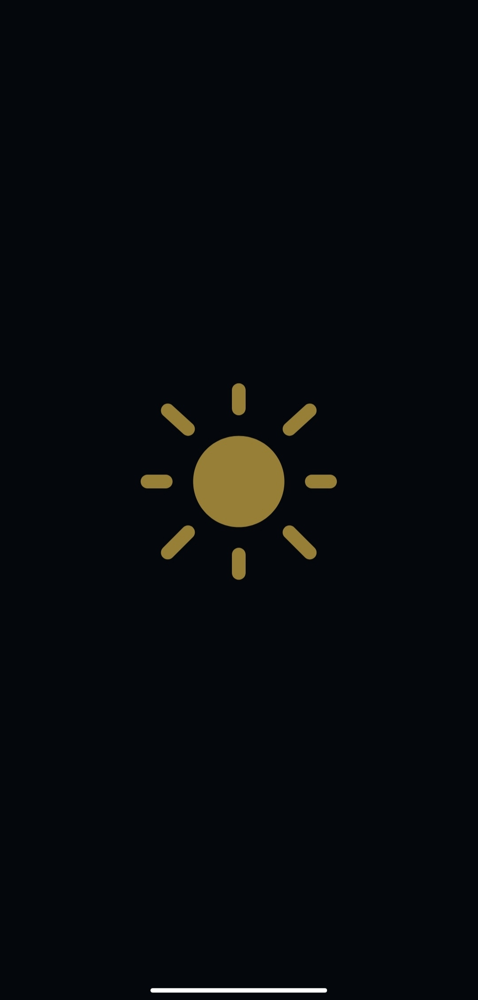
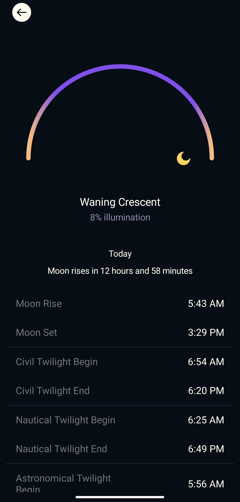

# Glare - Sunlight & Moonlight Tracker
Glare is a beautiful, intuitive sunlight and moonlight tracking app built using Kotlin and Jetpack Compose. Whether you're an astronomy enthusiast or simply someone who loves to track the position of the sun and moon, Glare provides precise timings for sunlight, moon phases, and twilight stages, all while offering a visually stunning experience.

## Features
- Sunlight Tracking: Track the sunrise, sunset, and the entire journey of the sun through the sky.
- Moonlight Tracking: Get accurate moonrise, moonset, and moon phases.
- Twilight Phases: Know the timings for different twilight phases:
  - Civil Twilight
  - Nautical Twilight
  - Astronomical Twilight
- Zonal Lights: Get the exact timing for when the sun and moon will appear or set based on your location and preferences.
- Stunning UI: A beautiful, user-friendly interface designed using Jetpack Compose.

  

  
   

